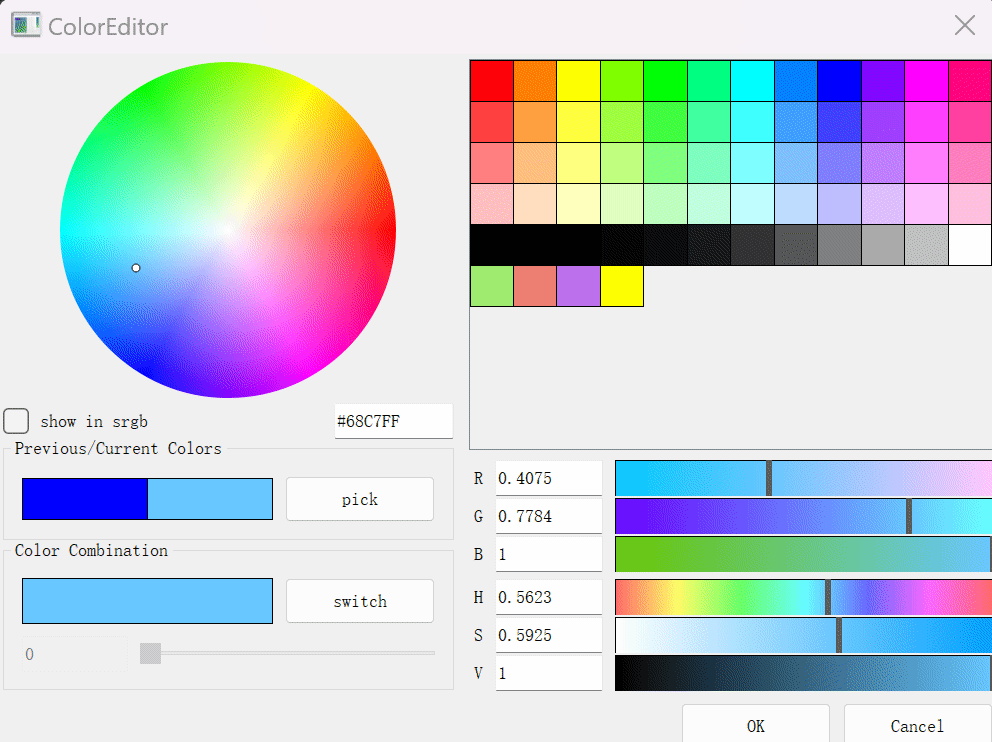
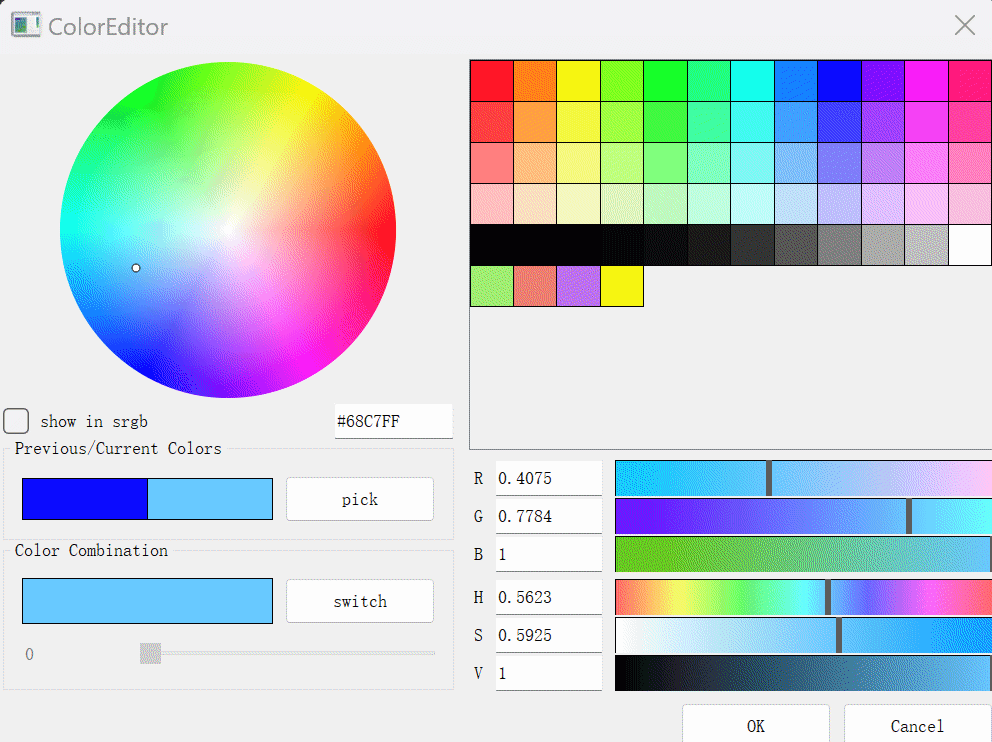
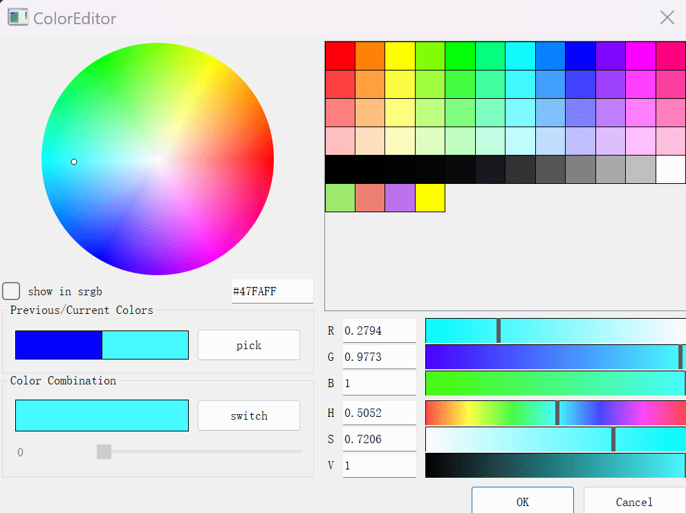
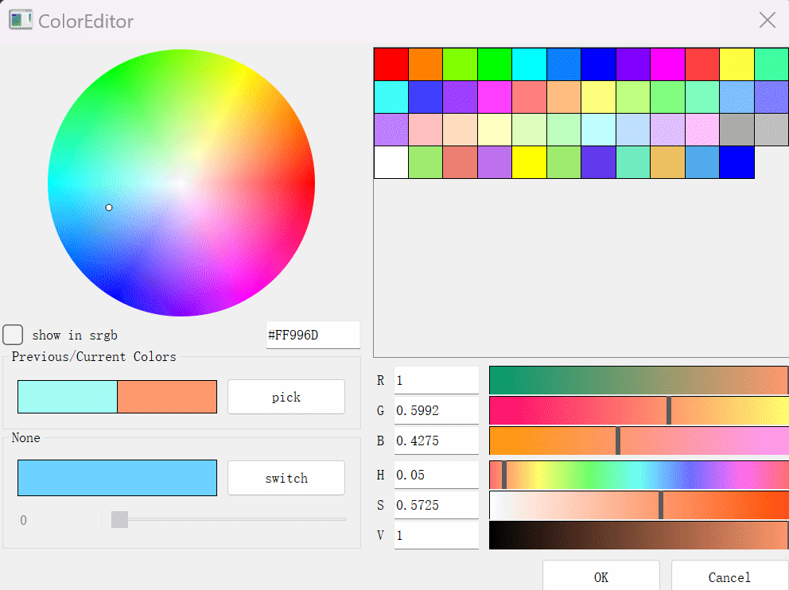
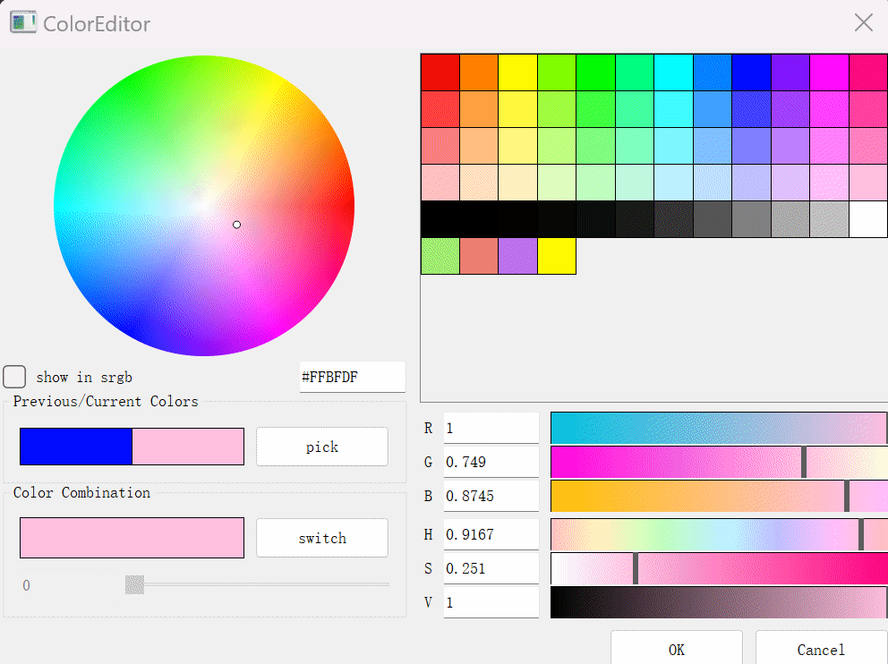
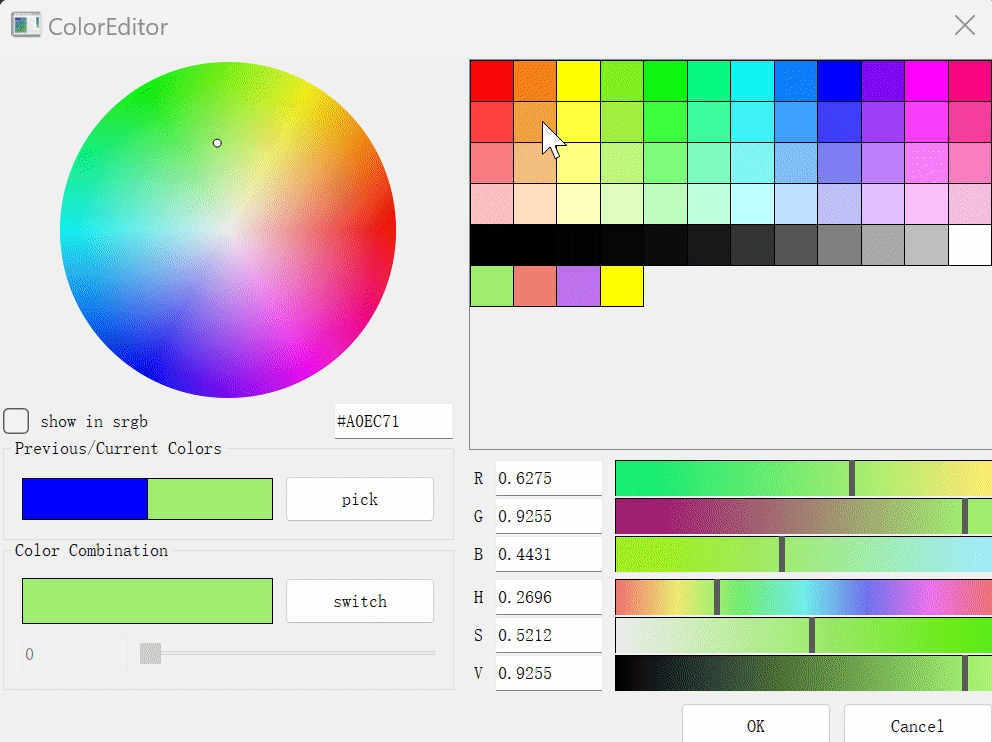
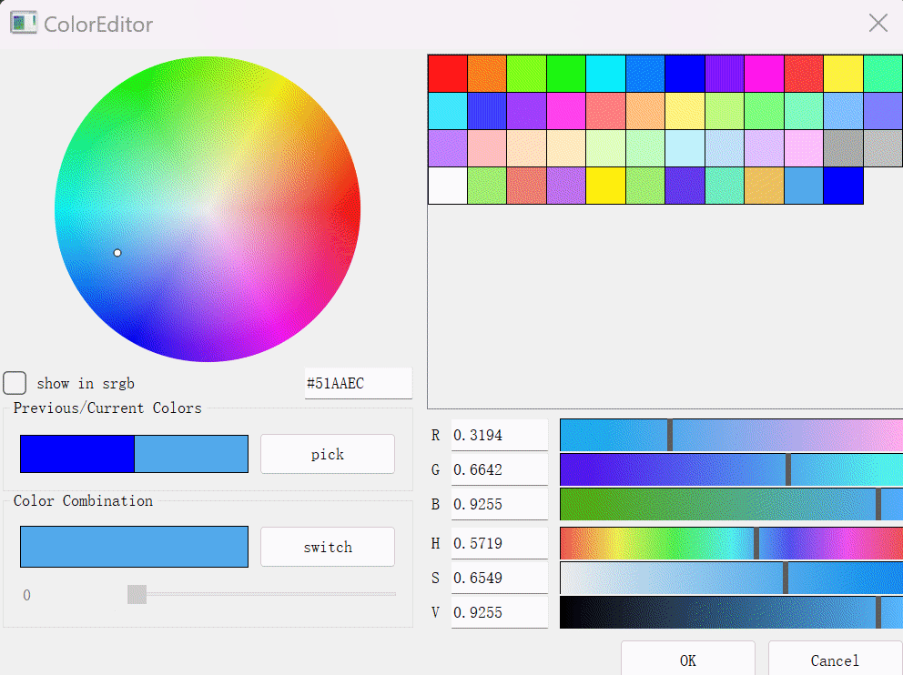

# QColorEditor

A qt based color editor, and also provides some color widgets:
* ColorWheel, a color wheel to select color
* GradientSlider, a gradient slider with gradient color
* ColorSpinHSlider, a horizontal color slider with label and spinbox
* ColorButton, a color button to show color, drag and drop color
* ColorPalette, a color palette to show a list of colors, drag and drop color
* ColorPreview, a color preview to show the current and previous color
* ColorComboWidget, a widget to switch color combinations
* ColorLineEdit, a color lineedit to show color name
* ColorPicker, a color picker to pick screen color

## Gallery
* srgb switch


* select color by color wheel


* select color by color text


* select color by color picker(not in srgb)


* select color by color slider


* select color by color palette


* save/remove color in color palette(permanent)


* previous/current color change


* color combination


## How to use
copy `ColorWidgets` forder(only contains 2 files: `ColorEditor.h` and `ColorEditor.cpp`) to your project, remenber add to your build system.

then you can use like:
```
#include "ColorWidgets/ColorEditor.h"
// ...
// call here, you can find this in MainWindow.cpp
auto btn = new ColorButton(this);
btn->setColor(Qt::blue);
setCentralWidget(btn);

connect(btn, &ColorButton::clicked, this, [this, btn](){
    auto color = ColorEditor::getColor(btn->color(), this, "");
    btn->setColor(color);
});
```